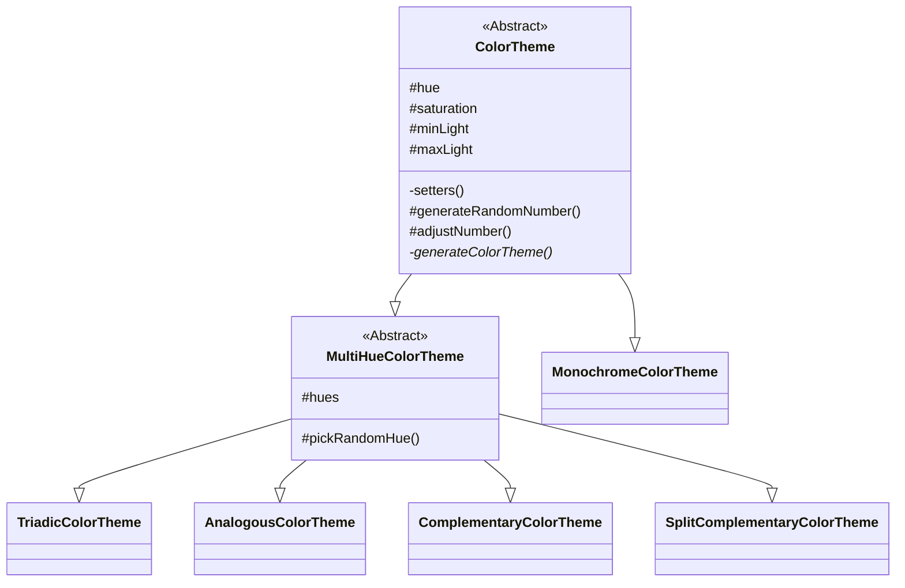

Template.

```mermaid
classDiagram
  class ColorTheme {
    #hue
    #saturation
    #minLight
    #maxLight
    -setters()
    #generateRandomNumber()
    #adjustNumber()
    -generateColorTheme()*
  }
  <<Abstract>> ColorTheme

  class MultiHueColorTheme {
    #hues
    #pickRandomHue()
  }
  <<Abstract>> MultiHueColorTheme


  ColorTheme --|> MultiHueColorTheme

  class MonochromeColorTheme
  class TriadicColorTheme
  class AnalogousColorTheme
  class ComplementaryColorTheme
  class SplitComplementaryColorTheme

  ColorTheme --|> MonochromeColorTheme
  MultiHueColorTheme --|> TriadicColorTheme
  MultiHueColorTheme --|> AnalogousColorTheme
  MultiHueColorTheme --|> ComplementaryColorTheme
  MultiHueColorTheme --|> SplitComplementaryColorTheme
```
