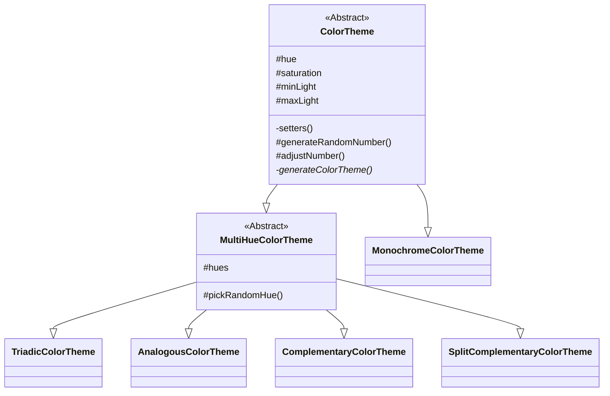

# color-theme-generator
color-theme-generator is a module used for generating color themes that are based in color-theory. The module can generate analogous, complementary, monochrome, split complementary and triadic themes. For explanation of these see [monchrome](https://en.wikipedia.org/wiki/Monochrome) and [others](https://en.wikipedia.org/wiki/Harmony_(color)). In addition it can set common CSS properties that affect the colors of HTMLElements. To visually test the colors in the browser the module can create color swatches, a HTMLElement with CSS properties that displays the color.

## Installing
```bash
npm install color-theme-generator
```

## Example usage - create a triadic theme and test the colors in the browser
```js
import { Triadic, HTMLColorSwatch } from 'color-theme-generator'

try {
  const swatchMaker = new HMTLColorSwatch()
  const triadicTheme = new Triadic()
  const requestedNumberOfColors = 5
  const generatedColorTheme = triadicTheme.generateColorTheme(requestedNumberOfColors)
  const colors = generatedColorTheme.colorsInTheme

  for (const color of colors) {
    const element = document.createElement('div')
    swatchMaker.turnElementIntoColorSwatch(element, color)
    document.querySelector('#container').appendChild(element)
  }
} catch (e) {
  console.log(e.message)
}
```

## Example usage - create a random color theme and set background-color with CSSColorSetter.
```js
import { RandomColorTheme, CSSColorSetter } from 'color-theme-generator'

try {
  const CSSSetter = new CSSColorSetter()
  const randomTheme = new RandomColorTheme()
  const generatedColorTheme = triadicTheme.generateColorTheme() // Generates a theme with 2 - 5 colors.
  const colors = generatedColorTheme.colorsInTheme

  const exampleElements = []
  for (const color of colors) {
    const element = document.createElement('div')
    CSSSetter.setCSSBackgroundColorPropertyOn(element, color)
    exampleElements.push(element)
  }
} catch (e) {
  console.log(e.message)
}
```

## Example usage - create a random color theme and set background-color without CSSColorSetter.
```js
import { RandomColorTheme } from 'color-theme-generator'

try {
  const CSSSetter = new CSSColorSetter()
  const randomTheme = new RandomColorTheme()
  const generatedColorTheme = triadicTheme.generateColorTheme() // Generates a theme with 2 - 5 colors.
  generatedColorTheme.sortColorsByLightness()
  const lightestColor = generatedColorTheme.colorsInTheme[0]

  const element = document.createElement('div')
  element.style.color = lightestColor.hsl
} catch (e) {
  console.log(e.message)
}
```

## Documentation
To see the full documentation click [here](./docs.md).

## Bugreports
To make bugreports and see current ones go to [github](https://github.com/Karin0002/color-theme-generator). 

### Disclosure
This module is part of an assignment in the course 1DV610, held by Linnaeus University. That means that the author of this moudle is a student.



